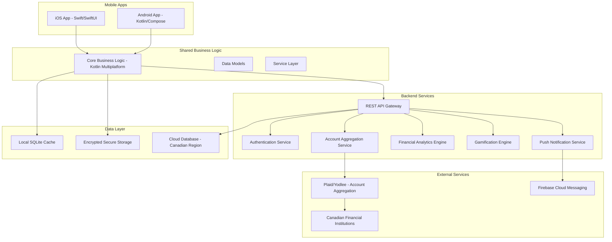
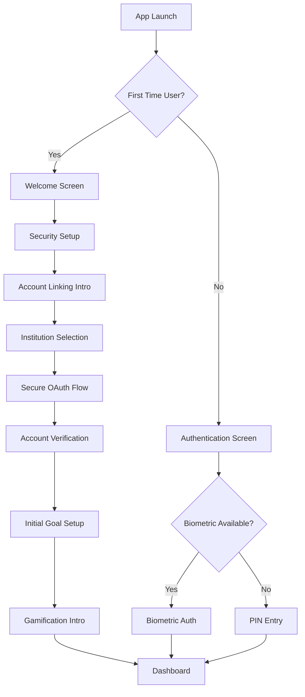
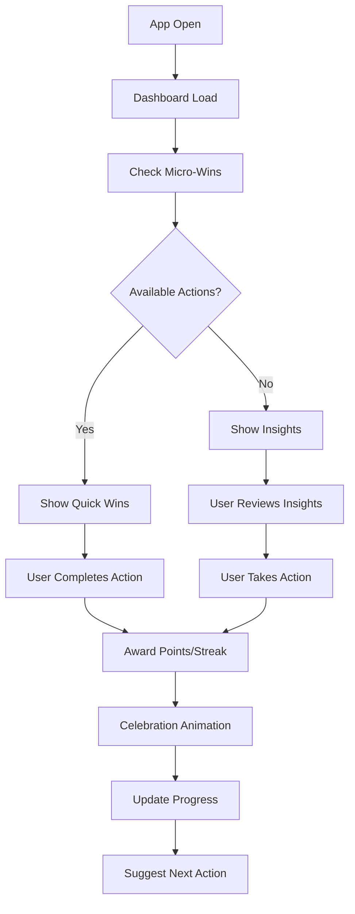
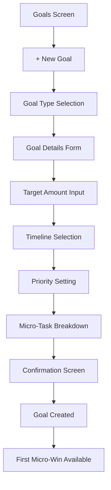

# Design Document

## Overview

North is a native mobile application for iOS and Android that serves as an intelligent personal finance partner for Canadians. The app architecture follows a clean, modular design with strong separation of concerns, emphasizing security, performance, and user engagement through gamification.

The application uses a hybrid approach with shared business logic and platform-specific UI implementations to ensure optimal native performance while maintaining development efficiency. The design prioritizes user trust through transparent security practices and reduces financial anxiety through intuitive, motivating user experiences.

## Architecture

### High-Level Architecture



### Technology Stack

**Mobile Applications:**
- iOS: Swift 5.7+, SwiftUI, Combine
- Android: Kotlin, Jetpack Compose, Coroutines
- Shared Logic: Kotlin Multiplatform Mobile (KMM)

**Backend Services:**
- API Gateway: Node.js/Express or Kotlin/Ktor
- Database: PostgreSQL (Canadian region)
- Caching: Redis
- Message Queue: Apache Kafka
- Authentication: OAuth 2.0 + JWT

**Third-Party Integrations:**
- Account Aggregation: Plaid (Canadian coverage) or Yodlee
- Push Notifications: Firebase Cloud Messaging
- Analytics: Custom analytics with privacy-first approach
- Crash Reporting: Platform-specific (Crashlytics)

## Components and Interfaces

### Core Mobile Components

#### 1. Authentication Module
```kotlin
interface AuthenticationService {
    suspend fun authenticateWithBiometrics(): AuthResult
    suspend fun authenticateWithPIN(pin: String): AuthResult
    suspend fun setupBiometricAuth(): SetupResult
    fun isAuthenticationRequired(): Boolean
}
```

#### 2. Account Management Module
```kotlin
interface AccountService {
    suspend fun linkAccount(institution: FinancialInstitution): LinkResult
    suspend fun refreshAccountData(): RefreshResult
    suspend fun getAccountSummary(): AccountSummary
    suspend fun getTransactionHistory(accountId: String, period: DateRange): List<Transaction>
}
```

#### 3. Financial Analytics Module
```kotlin
interface AnalyticsService {
    suspend fun generateSpendingInsights(): SpendingInsights
    suspend fun categorizeTransaction(transaction: Transaction): Category
    suspend fun generateRecommendations(): List<Recommendation>
    suspend fun calculateNetWorth(): NetWorthSummary
}
```

#### 4. Gamification Engine
```kotlin
interface GamificationService {
    suspend fun awardPoints(action: UserAction, points: Int): PointsResult
    suspend fun checkStreaks(): List<Streak>
    suspend fun unlockAchievement(achievementId: String): Achievement
    suspend fun getLevelProgress(): LevelProgress
    suspend fun getMicroWinOpportunities(): List<MicroWin>
}
```

#### 5. Goal Management Module
```kotlin
interface GoalService {
    suspend fun createGoal(goal: FinancialGoal): GoalResult
    suspend fun updateGoalProgress(goalId: String): ProgressUpdate
    suspend fun getGoalRecommendations(): List<GoalRecommendation>
    suspend fun breakDownGoalIntoMicroTasks(goalId: String): List<MicroTask>
}
```

#### 6. North AI Financial Friend Service
```kotlin
interface NorthAIService {
    suspend fun processUserQuery(query: String, context: UserFinancialContext): FriendlyAIResponse
    suspend fun generatePersonalizedInsights(): List<FriendlyInsight>
    suspend fun analyzeSpendingPattern(category: String, timeframe: DateRange): FriendlySpendingAnalysis
    suspend fun checkAffordability(expense: ExpenseRequest): FriendlyAffordabilityResult
    suspend fun explainTransaction(transactionId: String): FriendlyTransactionExplanation
    suspend fun suggestOptimizations(): List<FriendlyOptimizationSuggestion>
    suspend fun generateConversationStarters(): List<ConversationStarter>
    suspend fun celebrateAchievement(achievement: Achievement): CelebrationMessage
}

data class UserFinancialContext(
    val accounts: List<Account>,
    val recentTransactions: List<Transaction>,
    val goals: List<FinancialGoal>,
    val budgets: List<Budget>,
    val userPreferences: UserPreferences,
    val userName: String,
    val recentAchievements: List<Achievement>
)

data class FriendlyAIResponse(
    val message: String,
    val tone: ConversationTone,
    val supportingData: List<FriendlyDataPoint>,
    val actionableRecommendations: List<FriendlyRecommendation>,
    val followUpQuestions: List<String>,
    val celebrationElements: List<CelebrationElement>
)

data class FriendlyAffordabilityResult(
    val canAfford: Boolean,
    val encouragingMessage: String,
    val impactOnGoals: FriendlyGoalImpactAnalysis,
    val alternativeOptions: List<FriendlyAlternative>,
    val supportiveReasoning: String,
    val celebrationLevel: CelebrationType
)

data class ConversationStarter(
    val text: String,
    val category: ConversationCategory,
    val personalizedContext: String
)

enum class ConversationTone {
    ENCOURAGING, CELEBRATORY, SUPPORTIVE, GENTLE_GUIDANCE, EXCITED
}

enum class CelebrationType {
    NONE, GENTLE_PRAISE, ENTHUSIASTIC, MILESTONE_CELEBRATION
}
```

### User Interface Components

#### 1. Dashboard Screen
- **Net Worth Card**: Clean, prominent display of total financial position
- **Account Summary Grid**: Categorized account balances with visual indicators
- **Quick Actions Bar**: Fast access to common tasks (add transaction, check goal progress)
- **Gamification Panel**: Current streaks, points, and next micro-win opportunities
- **Insights Feed**: Personalized financial insights and recommendations

#### 2. Account Linking Flow
- **Institution Selection**: Search and select from Canadian financial institutions
- **Secure Connection**: OAuth-based linking with clear security messaging
- **Permission Explanation**: Transparent explanation of data access and usage
- **Success Confirmation**: Clear confirmation with next steps

#### 3. Gamification Interface
- **Progress Rings**: Circular progress indicators for goals and streaks
- **Achievement Gallery**: Visual display of earned badges and milestones
- **Streak Counters**: Daily/weekly streak tracking with visual momentum
- **Level Progression**: XP-style progression with unlockable features
- **Micro-Win Celebrations**: Animated celebrations for small achievements

#### 4. Financial Insights Dashboard
- **Spending Categories**: Interactive pie charts and trend lines
- **Budget vs. Actual**: Visual comparison with color-coded indicators
- **Recommendation Cards**: Actionable insights with clear next steps
- **Goal Progress**: Visual progress tracking with projected completion dates

## UI/UX Wireframes and User Experience Design

### Design Principles

**Visual Design Language:**
- Clean, minimalist interface with plenty of white space
- Calming color palette: Deep blues, soft greens, warm grays
- Modern typography with excellent readability
- Consistent iconography with rounded, friendly shapes
- Subtle animations that provide feedback without distraction

**User Experience Principles:**
- Reduce financial anxiety through clear, non-intimidating presentations
- Immediate positive feedback for all user actions
- Progressive disclosure of complex information
- Contextual help and guidance
- Accessibility-first design approach

### Screen Wireframes

#### 1. Onboarding Flow

```
┌─────────────────────────────────────┐
│ Welcome Screen                      │
├─────────────────────────────────────┤
│                                     │
│        [North Logo]                 │
│                                     │
│    Your Intelligent Finance        │
│         Partner                     │
│                                     │
│  Reduce anxiety, build wealth,      │
│     achieve your goals              │
│                                     │
│                                     │
│    [Get Started] [Sign In]          │
│                                     │
│         ● ○ ○ ○                     │
└─────────────────────────────────────┘

┌─────────────────────────────────────┐
│ Security Setup                      │
├─────────────────────────────────────┤
│    [Back]              [Skip]       │
│                                     │
│     🔒 Secure Your Account          │
│                                     │
│  Set up biometric authentication    │
│  for quick, secure access          │
│                                     │
│    [👆 Touch ID Setup]             │
│    [📱 Face ID Setup]              │
│    [🔢 PIN Setup]                  │
│                                     │
│  Your data is encrypted and         │
│  stored securely in Canada          │
│                                     │
│         [Continue]                  │
└─────────────────────────────────────┘
```

#### 2. Main Dashboard

```
┌─────────────────────────────────────┐
│ Dashboard                    [⚙️]   │
├─────────────────────────────────────┤
│ Good morning, Alex! 👋              │
│                                     │
│ ┌─────────────────────────────────┐ │
│ │ Net Worth                       │ │
│ │ $47,250 CAD        ↗️ +$1,200   │ │
│ │ ▓▓▓▓▓▓▓░░░ 68% to goal         │ │
│ └─────────────────────────────────┘ │
│                                     │
│ ┌─────────────┐ ┌─────────────────┐ │
│ │ Checking    │ │ Savings         │ │
│ │ $2,450      │ │ $15,800         │ │
│ │ RBC         │ │ Tangerine       │ │
│ └─────────────┘ └─────────────────┘ │
│                                     │
│ 🎯 Today's Micro-Wins               │
│ ✅ Check balance (+10 pts)          │
│ 🔥 3-day saving streak!             │
│ 📊 Categorize 2 transactions        │
│                                     │
│ 💡 Smart Insights                   │
│ "You're spending 15% less on        │
│  dining this month! 🎉"             │
│                                     │
│ [🏠] [📊] [🎯] [💳] [👤]           │
└─────────────────────────────────────┘
```

#### 3. Account Linking Flow

```
┌─────────────────────────────────────┐
│ Link Your Accounts          [✕]     │
├─────────────────────────────────────┤
│                                     │
│ Choose your financial institution   │
│                                     │
│ [🔍 Search banks...]               │
│                                     │
│ 🏛️ Major Banks                     │
│ ┌─────────────────────────────────┐ │
│ │ 🔴 RBC Royal Bank              │ │
│ │ 🟢 TD Canada Trust             │ │
│ │ 🔵 Bank of Montreal            │ │
│ │ 🟡 Scotiabank                  │ │
│ │ 🟠 CIBC                        │ │
│ └─────────────────────────────────┘ │
│                                     │
│ 🏪 Credit Unions & Others          │
│ ┌─────────────────────────────────┐ │
│ │ 🟣 Tangerine                   │ │
│ │ 🔶 President's Choice Financial │ │
│ │ ⚪ Desjardins                   │ │
│ └─────────────────────────────────┘ │
│                                     │
│ 🔒 Bank-level security guaranteed   │
└─────────────────────────────────────┘

┌─────────────────────────────────────┐
│ Secure Connection           [✕]     │
├─────────────────────────────────────┤
│                                     │
│        🔐 RBC Royal Bank            │
│                                     │
│ You'll be redirected to RBC's       │
│ secure login page                   │
│                                     │
│ ✅ We only access account balances  │
│    and transaction history          │
│ ✅ We never store your login        │
│    credentials                      │
│ ✅ You can disconnect anytime       │
│ ✅ Read-only access only            │
│                                     │
│ Your data stays in Canada and       │
│ follows PIPEDA privacy laws         │
│                                     │
│        [Continue Securely]          │
│                                     │
│    [Learn more about security]      │
└─────────────────────────────────────┘
```

#### 4. Gamification Interface

```
┌─────────────────────────────────────┐
│ Your Progress            [🏆]       │
├─────────────────────────────────────┤
│                                     │
│ Level 7 - Money Master 💰          │
│ ▓▓▓▓▓▓▓▓░░ 1,250/1,500 XP         │
│                                     │
│ 🔥 Current Streaks                  │
│ ┌─────────────────────────────────┐ │
│ │ Daily Check-in    🔥 12 days    │ │
│ │ Under Budget      💚 5 days     │ │
│ │ Goal Progress     🎯 3 days     │ │
│ └─────────────────────────────────┘ │
│                                     │
│ 🏅 Recent Achievements              │
│ ┌─────────────────────────────────┐ │
│ │ 💎 Savings Superstar            │ │
│ │    Saved $500 this month        │ │
│ │                                 │ │
│ │ 📊 Category Master              │ │
│ │    Categorized 100 transactions │ │
│ └─────────────────────────────────┘ │
│                                     │
│ ⚡ Quick Wins Available             │
│ • Categorize 3 transactions (+15)   │
│ • Update savings goal (+10)         │
│ • Review spending insights (+20)    │
│                                     │
│ [🏠] [📊] [🎯] [💳] [👤]           │
└─────────────────────────────────────┘
```

#### 5. Financial Goals Screen

```
┌─────────────────────────────────────┐
│ Your Goals               [+ New]    │
├─────────────────────────────────────┤
│                                     │
│ 🏠 Emergency Fund                   │
│ ┌─────────────────────────────────┐ │
│ │ $8,500 / $10,000                │ │
│ │ ▓▓▓▓▓▓▓▓▓░ 85%                 │ │
│ │ 📅 Target: Dec 2025             │ │
│ │ 🎯 $125/week to stay on track   │ │
│ └─────────────────────────────────┘ │
│                                     │
│ 🚗 New Car Fund                     │
│ ┌─────────────────────────────────┐ │
│ │ $12,000 / $25,000               │ │
│ │ ▓▓▓▓▓░░░░░ 48%                 │ │
│ │ 📅 Target: Jun 2026             │ │
│ │ 🎯 $200/week to stay on track   │ │
│ └─────────────────────────────────┘ │
│                                     │
│ 🏖️ Vacation Fund                   │
│ ┌─────────────────────────────────┐ │
│ │ $1,200 / $3,000                 │ │
│ │ ▓▓▓▓░░░░░░ 40%                 │ │
│ │ 📅 Target: Aug 2025             │ │
│ │ 🎯 $75/week to stay on track    │ │
│ └─────────────────────────────────┘ │
│                                     │
│ 💡 Goal Tip: You're ahead on your   │
│    emergency fund! Consider         │
│    boosting your vacation savings.  │
│                                     │
│ [🏠] [📊] [🎯] [💳] [👤]           │
└─────────────────────────────────────┘
```

#### 6. Spending Insights Screen

```
┌─────────────────────────────────────┐
│ Spending Insights        [📅 Nov]   │
├─────────────────────────────────────┤
│                                     │
│ This Month: $3,245 spent            │
│ ↗️ $200 more than last month        │
│                                     │
│ 📊 Spending Breakdown               │
│ ┌─────────────────────────────────┐ │
│ │     🏠 Housing      $1,200      │ │
│ │     🍽️ Food         $450       │ │
│ │     🚗 Transport    $320       │ │
│ │     🎬 Entertainment $180      │ │
│ │     🛒 Shopping     $95        │ │
│ └─────────────────────────────────┘ │
│                                     │
│ 💡 Smart Insights                   │
│ ┌─────────────────────────────────┐ │
│ │ 🎉 Great job!                   │ │
│ │ You spent 15% less on dining    │ │
│ │ out this month                  │ │
│ │                                 │ │
│ │ 💰 Potential Savings            │ │
│ │ 3 unused subscriptions found    │ │
│ │ Could save $47/month            │ │
│ │                                 │ │
│ │ [Review Subscriptions]          │ │
│ └─────────────────────────────────┘ │
│                                     │
│ [🏠] [📊] [🎯] [💳] [👤]           │
└─────────────────────────────────────┘

#### 7. Friendly AI Financial Advisor Interface

```
┌─────────────────────────────────────┐
│ Your Financial Friend       [💝]    │
├─────────────────────────────────────┤
│                                     │
│ ╭─────────────────────────────────╮ │
│ │ 👋 Hey Alex!                    │ │
│ │                                 │ │
│ │ I've been looking at your       │ │
│ │ finances and I'm really excited │ │
│ │ about your progress! You're     │ │
│ │ doing so well with your savings │ │
│ │ goals. 🎉                       │ │
│ │                                 │ │
│ │ What's on your mind today?      │ │
│ │ I'm here to help! 😊            │ │
│ ╰─────────────────────────────────╯ │
│                                     │
│ 💭 What would you like to chat     │
│    about?                           │
│                                     │
│ ╭─────────────────────────────────╮ │
│ │ 💸 "Can I afford something?"    │ │
│ ╰─────────────────────────────────╯ │
│                                     │
│ ╭─────────────────────────────────╮ │
│ │ 🎯 "How are my goals doing?"    │ │
│ ╰─────────────────────────────────╯ │
│                                     │
│ ╭─────────────────────────────────╮ │
│ │ 💡 "Help me save more money"    │ │
│ ╰─────────────────────────────────╯ │
│                                     │
│ ╭─────────────────────────────────╮ │
│ │ 📊 "Explain my spending"        │ │
│ ╰─────────────────────────────────╯ │
│                                     │
│ ┌─────────────────────────────────┐ │
│ │ 💬 Ask me anything...           │ │
│ │                            [→] │ │
│ └─────────────────────────────────┘ │
│                                     │
│ [🏠] [📊] [🎯] [💳] [👤]           │
└─────────────────────────────────────┘

┌─────────────────────────────────────┐
│ Your Financial Friend       [💝]    │
├─────────────────────────────────────┤
│                                     │
│                    ╭─────────────╮  │
│                    │ Can I afford │  │
│                    │ a $400       │  │
│                    │ weekend trip │  │
│                    │ to Montreal? │  │
│                    ╰─────────────╯  │
│                                     │
│ ╭─────────────────────────────────╮ │
│ │ 👋 Ooh, Montreal! I love that   │ │
│ │ city! Let me check your         │ │
│ │ finances... 🤔                  │ │
│ │                                 │ │
│ │ *drums fingers excitedly* 🥁     │ │
│ │                                 │ │
│ │ YES! You can totally do this!   │ │
│ │ 🎉✨                            │ │
│ │                                 │ │
│ │ Here's why I'm so excited       │ │
│ │ for you:                        │ │
│ │                                 │ │
│ │ ✅ Your entertainment budget    │ │
│ │    has $180 sitting there       │ │
│ │ ✅ You're actually $125 AHEAD   │ │
│ │    on your emergency fund! 🙌   │ │
│ │ ✅ You've been so good with     │ │
│ │    dining out - down 15%!       │ │
│ │                                 │ │
│ │ Honestly? Book that trip! You   │ │
│ │ deserve it and it won't hurt    │ │
│ │ your goals at all. Have fun! 🥳 │ │
│ ╰─────────────────────────────────╯ │
│                                     │
│ 💭 Want to talk about anything     │
│    else?                           │
│                                     │
│ ┌─────────────────────────────────┐ │
│ │ 💬 Ask me anything...           │ │
│ │                            [→] │ │
│ └─────────────────────────────────┘ │
│ • "Am I on track this month?"       │
│                                     │
│ [🏠] [📊] [🎯] [💳] [👤]           │
└─────────────────────────────────────┘

┌─────────────────────────────────────┐
│ Your Financial Friend       [💝]    │
├─────────────────────────────────────┤
│                                     │
│                    ╭─────────────╮  │
│                    │ Why did I    │  │
│                    │ spend so     │  │
│                    │ much on      │  │
│                    │ groceries    │  │
│                    │ last week?   │  │
│                    ╰─────────────╯  │
│                                     │
│ ╭─────────────────────────────────╮ │
│ │ 👋 Oh, I was wondering about    │ │
│ │ that too! Let me be your        │ │
│ │ financial detective 🕵️‍♀️          │ │
│ │                                 │ │
│ │ So here's what I found:         │ │
│ │                                 │ │
│ │ 📊 You spent $127 vs your       │ │
│ │    usual $85/week               │ │
│ │                                 │ │
│ │ 🔍 But wait! I dug deeper...    │ │
│ │                                 │ │
│ │ Nov 15: Metro - $67             │ │
│ │ (This was the big one!)         │ │
│ │ Nov 17: Loblaws - $38           │ │
│ │ Nov 19: Metro - $22             │ │
│ │                                 │ │
│ │ 💡 Aha! That Nov 15th trip      │ │
│ │ included cleaning supplies and  │ │
│ │ toiletries - not just food!     │ │
│ │                                 │ │
│ │ You were actually being super   │ │
│ │ smart by stocking up on         │ │
│ │ essentials! That's not          │ │
│ │ overspending - that's good      │ │
│ │ planning! 👏                    │ │
│ │                                 │ │
│ │ Mystery solved! 🎉              │ │
│ ╰─────────────────────────────────╯ │
│                                     │
│ [🏠] [📊] [🎯] [💳] [👤]           │
└─────────────────────────────────────┘
```

### User Flow Diagrams

#### Onboarding User Flow



#### Daily Engagement Flow



#### Goal Creation Flow



### Interaction Design Patterns

#### Micro-Win Celebrations

```
Animation Sequence:
1. User completes action (tap, swipe, etc.)
2. Immediate haptic feedback
3. Points counter animates up (+10, +25, etc.)
4. Confetti or sparkle animation (0.5s)
5. Streak indicator updates
6. Achievement badge appears (if earned)
7. Gentle bounce animation on progress bars
8. Success sound (optional, user preference)
```

#### Progressive Disclosure

```
Information Hierarchy:
Level 1: Essential info (balance, goal progress)
Level 2: Contextual details (last updated, trend)
Level 3: Deep insights (recommendations, analysis)

Interaction Pattern:
- Tap card → Expand details
- Swipe → Quick actions
- Long press → Context menu
- Pull down → Refresh data
```

#### Error State Handling

```
Error State Progression:
1. Loading state with skeleton UI
2. Retry mechanism with clear messaging
3. Offline mode with cached data
4. Graceful degradation with core features
5. Help/support access if persistent issues
```

### Accessibility Considerations

- **Screen Reader Support**: All UI elements have descriptive labels
- **High Contrast Mode**: Alternative color schemes for visual impairments
- **Large Text Support**: Dynamic type scaling up to 200%
- **Voice Control**: All actions accessible via voice commands
- **Motor Accessibility**: Large touch targets (44pt minimum)
- **Cognitive Accessibility**: Clear navigation, consistent patterns

### Responsive Design Considerations

- **Phone Sizes**: Optimized for 4.7" to 6.7" screens
- **Tablet Support**: Adaptive layouts for iPad and Android tablets
- **Orientation**: Portrait-first with landscape support for charts
- **Safe Areas**: Proper handling of notches and home indicators
- **Keyboard Avoidance**: Smart scrolling when keyboard appears

## Data Models

### Core Data Models

```kotlin
data class User(
    val id: String,
    val email: String,
    val profile: UserProfile,
    val preferences: UserPreferences,
    val gamificationData: GamificationProfile
)

data class Account(
    val id: String,
    val institutionId: String,
    val accountType: AccountType,
    val balance: Money,
    val currency: Currency = Currency.CAD,
    val lastUpdated: Instant
)

data class Transaction(
    val id: String,
    val accountId: String,
    val amount: Money,
    val description: String,
    val category: Category,
    val date: LocalDate,
    val isRecurring: Boolean = false
)

data class FinancialGoal(
    val id: String,
    val userId: String,
    val title: String,
    val targetAmount: Money,
    val currentAmount: Money,
    val targetDate: LocalDate,
    val priority: Priority,
    val microTasks: List<MicroTask>
)

data class GamificationProfile(
    val level: Int,
    val totalPoints: Int,
    val currentStreaks: List<Streak>,
    val achievements: List<Achievement>,
    val lastActivity: Instant
)
```

### Security Models

```kotlin
data class EncryptedData(
    val encryptedContent: ByteArray,
    val iv: ByteArray,
    val keyId: String
)

data class AuthToken(
    val accessToken: String,
    val refreshToken: String,
    val expiresAt: Instant,
    val scope: List<String>
)
```

## Error Handling

### Error Categories

1. **Network Errors**
   - Connection timeouts
   - API rate limiting
   - Service unavailability

2. **Authentication Errors**
   - Biometric authentication failures
   - Token expiration
   - Account lockouts

3. **Data Synchronization Errors**
   - Account linking failures
   - Transaction sync issues
   - Stale data conflicts

4. **Business Logic Errors**
   - Invalid goal parameters
   - Insufficient account permissions
   - Category assignment conflicts

### Error Handling Strategy

```kotlin
sealed class AppError {
    data class NetworkError(val cause: Throwable) : AppError()
    data class AuthenticationError(val reason: AuthFailureReason) : AppError()
    data class DataSyncError(val accountId: String, val cause: Throwable) : AppError()
    data class BusinessLogicError(val message: String) : AppError()
}

interface ErrorHandler {
    fun handleError(error: AppError): ErrorResolution
    fun shouldRetry(error: AppError): Boolean
    fun getErrorMessage(error: AppError): String
}
```

### User-Facing Error Messages

- **Connection Issues**: "We're having trouble connecting to your bank. Please try again in a moment."
- **Authentication Failures**: "Authentication failed. Please try again or use your backup PIN."
- **Data Sync Issues**: "Some account information may be outdated. Pull down to refresh."
- **Goal Conflicts**: "This goal conflicts with your existing priorities. Would you like to adjust?"

## Testing Strategy

### Unit Testing
- **Business Logic**: 90%+ coverage of core financial calculations and gamification logic
- **Data Models**: Validation logic and serialization/deserialization
- **Service Layer**: Mock external dependencies and test error scenarios

### Integration Testing
- **API Integration**: Test all backend service integrations with mock responses
- **Database Operations**: Test data persistence and retrieval with local test database
- **Third-Party Services**: Test account aggregation and push notification services

### UI Testing
- **Critical User Flows**: Account linking, goal creation, transaction categorization
- **Accessibility**: Screen reader compatibility and keyboard navigation
- **Cross-Platform Consistency**: Ensure identical behavior across iOS and Android

### Security Testing
- **Data Encryption**: Verify all sensitive data is properly encrypted at rest and in transit
- **Authentication**: Test biometric and PIN authentication flows
- **Session Management**: Test token refresh and session timeout scenarios

### Performance Testing
- **App Launch Time**: Target < 2 seconds cold start
- **Data Sync Performance**: Test with large transaction datasets
- **Memory Usage**: Monitor for memory leaks during extended usage
- **Battery Impact**: Minimize background processing and network requests

### Gamification Testing
- **Micro-Win Triggers**: Verify all user actions properly trigger rewards
- **Streak Calculations**: Test streak logic across different time zones and usage patterns
- **Achievement Unlocking**: Verify achievement conditions and prevent duplicate awards
- **Progress Persistence**: Ensure gamification data survives app updates and device changes

### Canadian Compliance Testing
- **PIPEDA Compliance**: Verify data handling meets Canadian privacy requirements
- **Financial Institution Integration**: Test with major Canadian banks and credit unions
- **Currency and Localization**: Test CAD formatting and Canadian financial terminology
- **Tax Calculation**: Verify RRSP/TFSA contribution calculations and tax implications